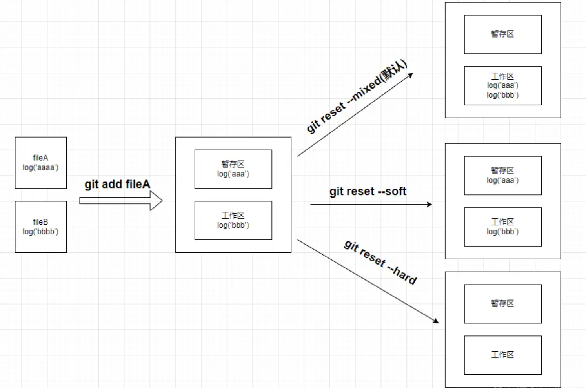

# git回滚操作

## git回滚

在git中，回退操作总是无法完全避免的 当我们使用回退操作的时候，一般都会涉及到两个命令

`git reset`

`git revert`

## git reset

`git reset [commit-id]`操作回退到对应的`commit-id`，它会完成把`commit-id`之前的所有的所有`commit`的记录按照对应的模式进行处理

- `commit-id`默认就是当前最近的一条`commit-id`，此时`commit`的所有记录不会更改，只会更具明命令中的模式对当前工作区与暂存区的修改做对应的操作
- `commit-id`如果为非最近的一条
  - 那么首先会把 `commit-id`之后的所有的commit记录所有的改动都按照命令中的模式处理到暂存区与工作区
  - 再去按照命令中的模式操作当前的暂存区和工作区的内容

模式（默认为--mixed）

- `--hard` 回退到指定版本，工作区内容删除，暂存区内容删除
- `--soft` 回退到指定版本，工作区内容保留，暂存区内容保留
- `--mixed` 回退到指定版本，工作区内容保留，暂存区内容回退到工作区

`git reset [--hard | --soft | --mixed（默认值）] [HEAD（默认值） | commit-id | origin/远程分支 ] [path（默认值为全部文件）]`

## git revert

跟`git reset`用法基本一致，`git revert` 撤销某次操作，此次操作之前和之后的 commit和history都会保留，并且把这次撤销，作为一次最新的提交

`git revert [commit-id]`

## reset 与 revert的区别

- `reset`会把`commit`记录直接抹除，而`revert`会在原有基础上新添加一条记录，是单独的一条回滚`commit`
- `reset`要慎用，`revert`要更加安全一些
- `reset`更适合操作本地的`commit`记录，如果是远程的`commit`，那么会涉及到协作者的git记录同步的问题
- `revert`则可以用于本地和远程

撤销（revert）被设计为撤销公开的提交（比如已经push）的安全方式，git reset被设计为重设本地更改

因为两个命令的目的不同，它们的实现也不一样：重设完全地移除了一堆更改，而撤销保留了原来的更改，用一个新的提交来实现撤销

- git revert是用一次新的commit来回滚之前的commit，git reset是直接删除指定的commit
- git reset 是把HEAD向后移动了一下，而git revert是HEAD继续前进，只是新的commit的内容和要revert的内容正好相反，能够抵消要被revert的内容
- 在回滚这一操作上看，效果差不多。但是在日后继续 merge 以前的老版本时有区别
- 如果回退分支的代码以后还需要的情况则使用git revert， 如果分支是提错了没用的并且不想让别人发现这些错误代码，则使用git reset

::: danger 🌟
git revert是用一次逆向的commit“中和”之前的提交，因此日后合并老的branch时，之前提交合并的代码仍然存在，导致不能够重新合并

但是git reset是之间把某些commit在某个branch上删除，因而和老的branch再次merge时，这些被回滚的commit应该还会被引入
:::